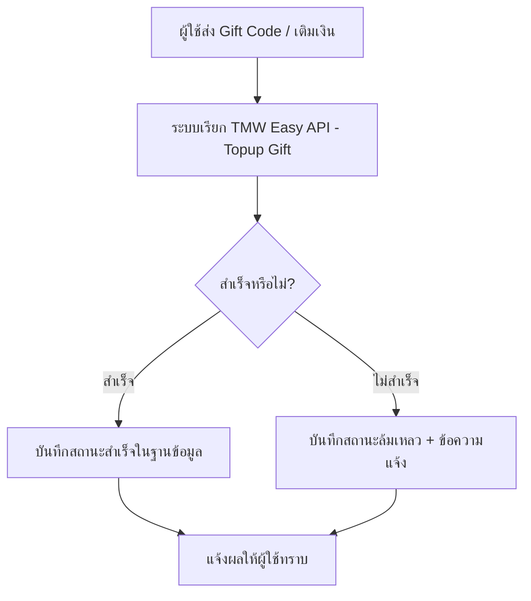
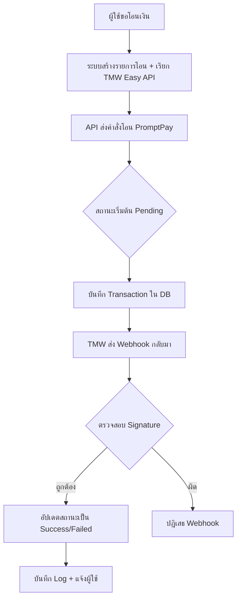

# TMW Easy API - Example Gift + PromptPay (PPH)

ตัวอย่างการใช้งาน **TMW Easy API** สำหรับ

- **TrueWallet Gift** — เติมเงินบัตรของขวัญ TrueWallet
- **PromptPay (PPH)** — โอนเงินผ่าน PromptPay / ธนาคาร

โครงการนี้เป็นตัวอย่างโค้ด **PHP Native** (ไม่ใช้ Framework) ที่แสดงวิธีเรียกใช้งานทั้งสอง API อย่างง่ายและปลอดภัย

---

## คุณสมบัติ

- เรียกใช้งาน API ง่ายด้วยคลาสที่เขียนไว้ให้
- รองรับการตรวจสอบสถานะ (Check Status / Callback)
- ใช้ **PDO Prepared Statement** เพื่อความปลอดภัยจาก SQL Injection
- มีตัวอย่างโค้ดที่พร้อมรันในแต่ละโฟลเดอร์
- แยกโค้ดชัดเจนระหว่าง TrueWallet Gift และ PromptPay

## รูปแบบการทำงานของทั้ง 2 API

### 1. TrueWallet Gift API (โฟลเดอร์: `Api-TrueWallet-Gift`)

**วัตถุประสงค์**: ใช้สำหรับ **เติมเงินบัตรของขวัญ TrueWallet** ให้กับเบอร์โทรศัพท์ลูกค้า

#### Flow การทำงาน

### 2. 2. PromptPay API (โฟลเดอร์: `API-PromptPay`)

**วัตถุประสงค์**: ใช้สำหรับ **โอนเงินผ่าน PromptPay (พร้อมเพย์)** โดยไม่ต้องกรอกเลขบัญชีธนาคาร

#### Flow การทำงาน

